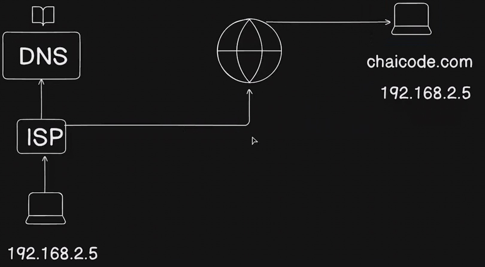

# Summary Notes:-

1. **How does the internet works**

Lets say you want to access chaicode.com and so you entered the url of chaicode.com in your browser and then the browser first check if the IP for the DNS already is stored in it as a cache or not. If not then it sends a request to the ISP (Internet Service Provider) and then the ISP tries to find the IP for the asked DNS name. If it is not able to goes to the DNS authorities to get the IP and the process goes on and on till the root authorities to get IP for the corresponding DNS.

Once the IP is retrived, the connection then stablished by making use of that IP.

2. A big picture of the web applications

HTML is used for structure and information, CSS does the formating and JS is the functionality to any web application (which is used to perform actions).

3. Frontenf backend and APIs

