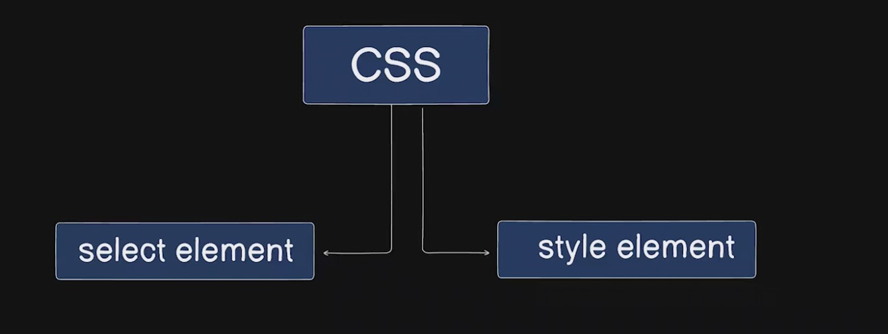

# CSS Notes

## 1. Introduction to CSS

### What is CSS?

-
- It allows developers to separate content (HTML) from design (CSS), making it easier to maintain and update.
- The main job of CSS is selecting element and styling the element

  

- There are few things that we need to work on to use CSS in better way to make web application beautiful that are as follows:-

  - Font used in the application
  - Image placing. The beautifully put images are the better the website looks.
  - Component design and placing. How will the button looks like, list look like, card etc.
  -

### Why was CSS created?

- To provide a way to style and layout web pages independently of the HTML structure.
- CSS enables consistency across multiple web pages by centralizing styles.

### How does CSS work?

1. **Selectors and Rules**:

   - CSS targets HTML elements using **selectors** and applies **rules** (property-value pairs).

2. **Browser Rendering**:

   - Browsers interpret CSS rules and apply them to the corresponding HTML elements.

### Example:

```html
<!DOCTYPE html>
<html>
  <head>
    <style>
      body {
        font-family: Arial, sans-serif;
        background-color: #f4f4f4;
      }
    </style>
  </head>
  <body>
    <h1>Welcome to CSS</h1>
    <p>This is an example of inline CSS styling.</p>
  </body>
</html>
```

- The `<style>` tag is used to embed CSS directly in an HTML document.

---

## 2. Ways to Apply CSS

### Inline CSS

- Written directly within an HTML tag using the `style` attribute.
- Example:
  ```html
  <p style="color: blue;">This is a blue paragraph.</p>
  ```

### Internal CSS

- Written inside a `<style>` tag within the `<head>` section of the HTML document.
- Example:
  ```html
  <style>
    p {
      font-size: 16px;
      color: green;
    }
  </style>
  ```

### External CSS

- Written in a separate file with a `.css` extension and linked to the HTML document.
- Example:
  ```html
  <link rel="stylesheet" href="styles.css" />
  ```

---

## 3. CSS Syntax

### Basic Structure

```css
selector {
  property: value;
}
```

- **Selector**: Targets HTML elements (e.g., `p`, `.class`, `#id`).
- **Property**: Defines what to style (e.g., `color`, `font-size`).
- **Value**: Specifies the style (e.g., `red`, `16px`).

### Example:

```css
h1 {
  color: blue;
  font-size: 24px;
}
```

## 4. Selectors

### Types of Selectors

1. **Universal Selector**: Targets all elements.

   ```css
   * {
     margin: 0;
     padding: 0;
     box-sizing: border-box;
   }
   ```

2. **Type Selector**: Targets specific HTML elements by name.

   ```css
   p {
     font-size: 16px;
     margin-bottom: 10px;
   }
   ```

3. **Class Selector**: Targets elements with a specific class.

   ```css
   .highlight {
     background-color: #21a2c9;
   }
   ```

4. **ID Selector**: Targets an element with a specific ID.

   ```css
   #header {
     background-color: #860303;
   }
   ```

5. **Attribute Selector**: Targets elements based on attribute values.

   ```css
   input[type="text"] {
     border: 2px solid #21a2c9;
   }
   ```

6. **Descendant Selector**: Targets elements nested inside a specific parent.

   ```css
   article p {
     font-style: italic;
     background-color: #1a1a1a;
     color: #fff;
     padding: 10px;
   }
   ```

7. **Child Selector**: Targets direct children of a specific parent.

   ```css
   div > p {
     background-color: #880404;
   }
   ```

8. **Adjacent Sibling Selector**: Targets the next immediate sibling of an element.

   ```css
   h1 + p {
     font-weight: bold;
   }
   ```

9. **General Sibling Selector**: Targets all siblings of an element.

   ```css
   h2 ~ p {
     color: #860303;
   }
   ```

10. **Pseudo-class Selector**: Targets elements based on their state.

    ```css
    a:hover {
      background-color: #14a50e;
      text-decoration: none;
      color: #1a1a1a;
      padding: 5px;
      margin: 4px;
    }
    ```

11. **Pseudo-element Selector**: Targets specific parts of an element.

    ```css
    p::first-letter {
      font-weight: bold;
      font-size: 30px;
    }
    ```

12. **Grouping Selector**: Applies the same styles to multiple elements.

    ```css
    h1,
    h2,
    h3 {
      color: orange;
    }
    ```

13. **Compound Selector**: Combines multiple simple selectors to target elements.

    ```css
    div.card {
      background-color: #f4f4f4;
      padding: 10px;
    }
    ```

14. **Not Selector**: Excludes elements that match a specific selector.

    ```css
    p:not(.highlight) {
      color: gray;
    }
    ```

15. **Nth-child Selector**: Targets elements based on their order.
    ```css
    li:nth-child(odd) {
      background-color: #f0f0f0;
    }
    ```

---

## 5. Box Model

- Every HTML element is considered a rectangular box, consisting of:
  1. **Content**: The actual content inside the element.
  2. **Padding**: Space between the content and the border.
  3. **Border**: The edge surrounding the padding.
  4. **Margin**: Space outside the border.

### Box Model Example:

```css
div {
  width: 300px;
  padding: 20px;
  border: 5px solid black;
  margin: 15px;
}
```

- Total width = Content width + Padding + Border + Margin.

---

## 6. Positioning

### Position Properties

1. **Static** (default): Elements are positioned in the normal document flow.
2. **Relative**: Position relative to its normal position.
3. **Absolute**: Positioned relative to its nearest positioned ancestor.
4. **Fixed**: Positioned relative to the viewport.
5. **Sticky**: Toggles between relative and fixed based on scroll.

### Example:

```css
div {
  position: absolute;
  top: 50px;
  left: 100px;
}
```

---

## 7. Responsive Design

- Ensures the webpage looks good on all devices.

### Media Queries

```css
@media (max-width: 600px) {
  body {
    background-color: lightblue;
  }
}
```

---

## 8. CSS Flexbox

- A layout model for creating flexible and responsive designs.

### Example:

```css
.container {
  display: flex;
  justify-content: center;
  align-items: center;
  height: 100vh;
}
```

---

## 9. Best Practices

1. Use external CSS for better maintainability.
2. Use semantic class names for clarity.
3. Keep styles DRY (Don’t Repeat Yourself).
4. Validate CSS with [W3C CSS Validator](https://jigsaw.w3.org/css-validator/).
5. Use CSS variables for reusable values:

   ```css
   :root {
     --main-color: #3498db;
   }

   h1 {
     color: var(--main-color);
   }
   ```

---

## 10. Resources for Further Learning

- [MDN Web Docs](https://developer.mozilla.org/en-US/docs/Web/CSS)
- [W3Schools CSS Tutorial](https://www.w3schools.com/css/)
- [CSS Tricks](https://css-tricks.com/)

---

## 11. Tips:

- Lets say you want to create a element in html page with the class name using emmet, you can make use of VS Code shortcut trick which looks like:

```
div.card   ->    By just typing the above in the VSCode and entering it will generate a 'div' element of 'card' class name:

<div class="card"></div>
```

-
